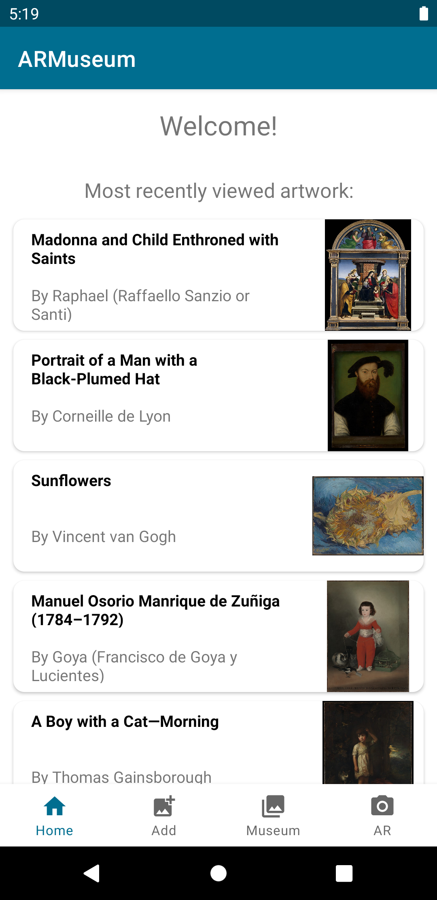
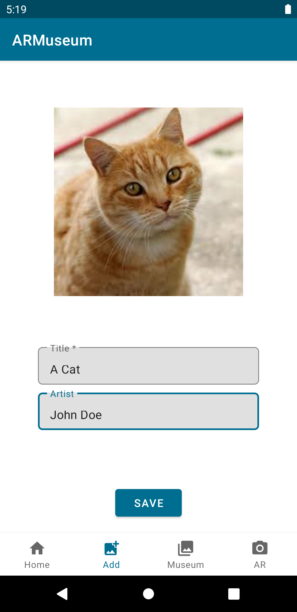
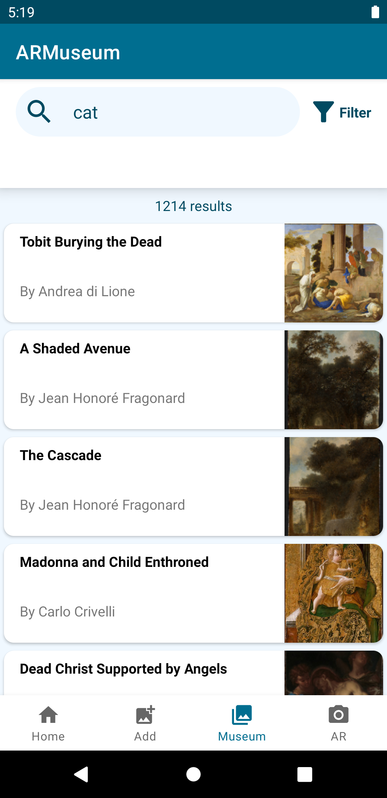
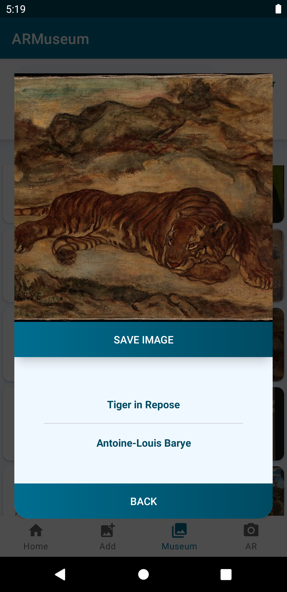
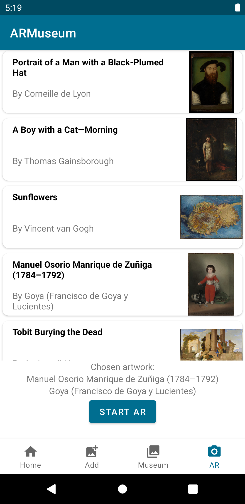

# ARMuseum
Try out how paintings would look like on your very own wall utilizing Internal Storage, ARCore, a gravity sensor and paintings from [The Metropolitan Museum of Art Collection API](https://metmuseum.github.io/).

## Features
ARMuseum does not require any registration in order to fully experience the application.
-	See the most recently browsed images in the Home tab
-	Save images to Room database via the Add tab
-	Browse historical artwork via the Museum tab
-	Utilize the AR tab to see what the images would look like on a wall

## Technical requirements
-	Android 8.0 (API level 26)
-	Permission to access gallery and camera
-	Gravity sensor
-	Internet connection

## Installation
Download the .apk file from [here](https://github.com/metropolia-ar/ARMuseumProject/releases/tag/1.0) to your Android phone and install it. Optionally, the source code can also be downloaded from the provided link.

## License
The application is under the MIT License.

## Developers
- [Markus Nivasalo](https://github.com/markusniv)
- [Oskari Arponen](https://github.com/AOskari)
- [Jani Salo](https://github.com/Janiksa)
- [Sirja Kosonen](https://github.com/sirjak)

## Views

  
  
  
  
   

